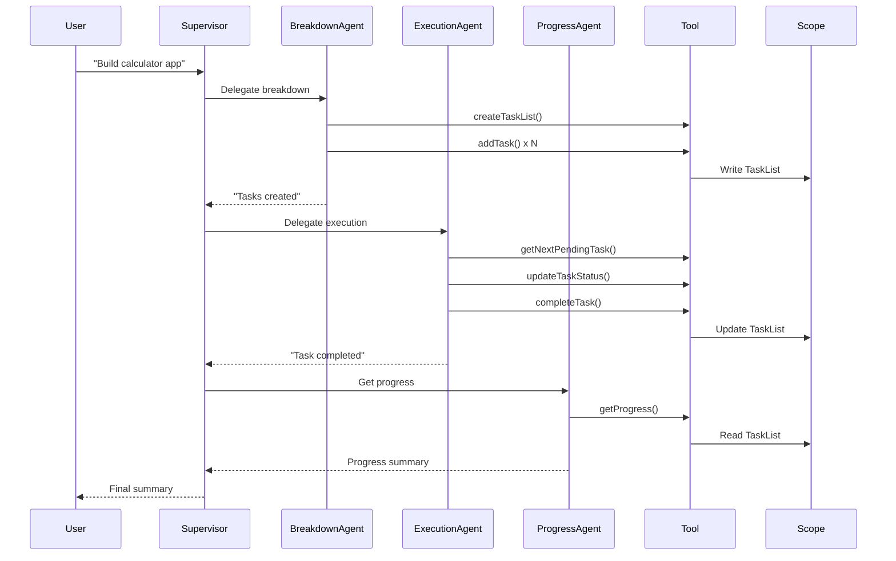

# Task-Tracking-Supervisor Example - Implementation Plan

## Overview

This example demonstrates the same task-tracking use case as `task-tracking`, but using **SupervisorPlanner** instead of AI Service with Tools. This comparison helps understand the trade-offs between different architectural approaches in langchain4j.

## Architecture Comparison

### task-tracking (AI Service + Tool)
```
User Request → TaskTrackingAssistant (AI Service)
                      ↓
              TaskManagementTool (@Tool methods)
                      ↓
                  TaskList (State)
```

### task-tracking-supervisor (SupervisorPlanner + Sub-Agents)
```
User Request → TaskTrackingSupervisor (Supervisor)
                      ↓
              SupervisorPlanner (Coordinator)
                      ↓
        ┌─────────────┴─────────────┐
        ↓                           ↓
TaskBreakdownAgent          TaskExecutionAgent
        ↓                           ↓
TaskManagementTool          TaskManagementTool
        ↓                           ↓
                  TaskList (Shared State via AgenticScope)
```

## Key Differences

| Aspect | AI Service + Tool | SupervisorPlanner |
|--------|-------------------|-------------------|
| **Coordination** | Single AI decides tool calls | Supervisor coordinates multiple agents |
| **State Management** | Tool manages state internally | AgenticScope for shared state |
| **Complexity** | Simpler, direct | More complex, multi-agent |
| **Control Flow** | AI-driven tool selection | Supervisor-driven agent selection |
| **Flexibility** | Limited to tool capabilities | Can delegate to specialized agents |
| **Overhead** | Lower (fewer LLM calls) | Higher (supervisor + agent calls) |

## Feasibility Analysis

### ✅ What Works Well

1. **Task Breakdown**: Can be delegated to a specialized agent
2. **Task Execution**: Can be handled by another agent
3. **State Sharing**: AgenticScope allows agents to share TaskList state
4. **Progress Tracking**: Agents can read/write progress to scope
5. **Iterative Execution**: Supervisor can coordinate multiple execution cycles

### ⚠️ Concerns and Challenges

#### 1. **Increased Complexity Without Clear Benefit**
- **Issue**: For this use case, the supervisor adds coordination overhead without significant value
- **Why**: Task management is inherently sequential and doesn't benefit from multi-agent parallelization
- **Impact**: More LLM calls, higher latency, increased cost

#### 2. **State Management Complexity**
- **Issue**: TaskList state must be carefully managed in AgenticScope
- **Why**: Multiple agents need to read/write the same state consistently
- **Impact**: Risk of state inconsistency if not properly synchronized

#### 3. **Less Direct Control**
- **Issue**: Supervisor decides which agent to call based on LLM reasoning
- **Why**: Less predictable than direct tool calls in AI Service approach
- **Impact**: Harder to guarantee specific execution flow

#### 4. **Supervisor Overhead**
- **Issue**: Each coordination decision requires an LLM call to the supervisor
- **Why**: SupervisorPlanner uses PlannerAgent to decide next steps
- **Impact**: 2-3x more LLM calls compared to AI Service approach

#### 5. **Limited Iterative Control**
- **Issue**: Supervisor's maxAgentsInvocations limits total agent calls
- **Why**: Designed for finite workflows, not open-ended iteration
- **Impact**: May not complete all tasks if limit is reached

#### 6. **Response Strategy Mismatch**
- **Issue**: SupervisorResponseStrategy (LAST, SUMMARY, SCORED) doesn't naturally fit task tracking
- **Why**: We need structured task list output, not just text summaries
- **Impact**: May need custom output handling via AgenticScope

### 🤔 Architectural Concerns

#### When Supervisor Makes Sense
- **Multiple specialized domains**: Different agents for different expertise
- **Parallel execution**: Independent tasks that can run concurrently
- **Complex decision trees**: Dynamic routing based on context
- **Agent reusability**: Same agents used in different workflows

#### Why It's Overkill for Task Tracking
- **Single domain**: All operations are task management
- **Sequential execution**: Tasks must be executed in order
- **Simple flow**: Break down → Execute → Track progress
- **No reusability benefit**: Agents are specific to this workflow

## Proposed Architecture

Despite concerns, here's how we can implement it to demonstrate the approach:

### Components

#### 1. Domain Models (Reuse from task-tracking)
- `Task`, `TaskStatus`, `TaskList` - Same as before

#### 2. TaskManagementTool (Reuse from task-tracking)
- Same tool with @Tool methods
- Shared by all agents

#### 3. Sub-Agents

**TaskBreakdownAgent** (AI Agent)
```java
@Agent(description = "Breaks down complex requests into manageable sub-tasks")
public interface TaskBreakdownAgent {
    @UserMessage("Break down the request into tasks and create a task list")
    String breakdownTask(@V("request") String request);
}
```

**TaskExecutionAgent** (AI Agent)
```java
@Agent(description = "Executes the next pending task and updates status")
public interface TaskExecutionAgent {
    @UserMessage("Execute the next pending task")
    String executeNextTask();
}
```

**TaskProgressAgent** (AI Agent)
```java
@Agent(description = "Provides progress summary of current tasks")
public interface TaskProgressAgent {
    @UserMessage("Get current progress summary")
    String getProgress();
}
```

#### 4. TaskTrackingSupervisor (Main Interface)
```java
public interface TaskTrackingSupervisor {
    @Agent
    ResultWithAgenticScope<String> manageTask(@V("request") String request);
}
```

### Workflow



## Implementation Plan

### Phase 1: Setup
1. Copy domain models from task-tracking
2. Copy TaskManagementTool from task-tracking
3. Create pom.xml with agentic dependencies
4. Set up directory structure

### Phase 2: Sub-Agents
1. Implement TaskBreakdownAgent interface
2. Implement TaskExecutionAgent interface
3. Implement TaskProgressAgent interface
4. Configure each with TaskManagementTool

### Phase 3: Supervisor
1. Create TaskTrackingSupervisor interface
2. Build supervisor with sub-agents
3. Configure SupervisorPlanner settings
4. Set up AgenticScope for state sharing

### Phase 4: Testing
1. Test task breakdown flow
2. Test task execution flow
3. Test progress tracking
4. Test complete workflow
5. Compare with task-tracking performance

### Phase 5: Documentation
1. Write README.md with comparison
2. Document architectural trade-offs
3. Provide performance metrics
4. Include when to use each approach

## Expected Challenges

### 1. State Synchronization
**Challenge**: Ensuring TaskList state is consistent across agents
**Solution**: Use AgenticScope carefully, validate state after each agent call

### 2. Supervisor Decision Making
**Challenge**: Supervisor may not always choose the right agent
**Solution**: Provide clear agent descriptions and supervisorContext

### 3. Execution Flow Control
**Challenge**: Controlling iterative task execution
**Solution**: May need to call supervisor multiple times or increase maxAgentsInvocations

### 4. Performance
**Challenge**: More LLM calls = higher latency and cost
**Solution**: Document this trade-off clearly in README

### 5. Output Formatting
**Challenge**: Getting structured task list output
**Solution**: Use AgenticScope to read TaskList state directly, not just text response

## Success Criteria

1. ✅ Successfully breaks down tasks using supervisor coordination
2. ✅ Executes tasks iteratively through agent delegation
3. ✅ Tracks progress accurately via shared state
4. ✅ Demonstrates supervisor pattern clearly
5. ✅ Documents trade-offs vs AI Service approach
6. ✅ Provides clear guidance on when to use each pattern

## Comparison Metrics

We'll measure and document:
- **LLM Calls**: Count per workflow
- **Latency**: Time to complete workflow
- **Cost**: Estimated token usage
- **Complexity**: Lines of code, configuration
- **Maintainability**: Ease of understanding and modifying
- **Flexibility**: Ability to extend with new features

## Recommendation

### Use AI Service + Tool (task-tracking) When:
- ✅ Single domain operations
- ✅ Sequential workflow
- ✅ Performance is critical
- ✅ Simplicity is preferred
- ✅ Direct control needed

### Use SupervisorPlanner (task-tracking-supervisor) When:
- ✅ Multiple specialized domains
- ✅ Complex decision trees
- ✅ Agent reusability important
- ✅ Parallel execution possible
- ✅ Learning/demonstration purposes

## Conclusion

**Is it possible?** Yes, we can implement task-tracking with SupervisorPlanner.

**Is it recommended?** No, for this specific use case, AI Service + Tool is more appropriate because:
1. Task management is a single domain
2. Workflow is inherently sequential
3. No benefit from multi-agent coordination
4. Higher complexity without clear value
5. More expensive (more LLM calls)

**Why implement it anyway?**
1. **Educational value**: Demonstrates supervisor pattern
2. **Comparison**: Shows trade-offs between approaches
3. **Pattern library**: Provides reference for when supervisor IS appropriate
4. **Completeness**: Covers different architectural patterns in examples

This example serves as a **learning tool** to understand when and why to choose different architectural patterns in langchain4j, even if this particular use case is better suited to the simpler AI Service approach.