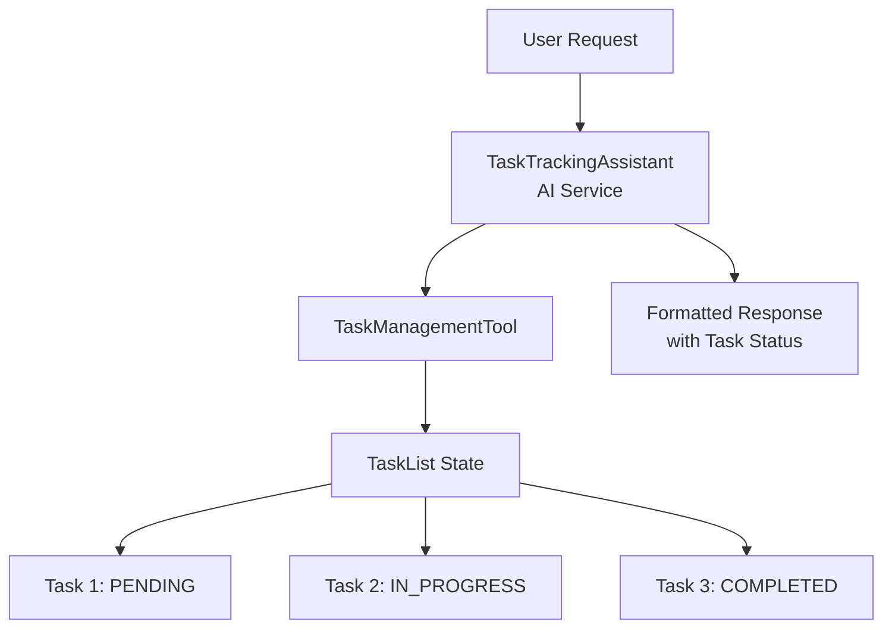
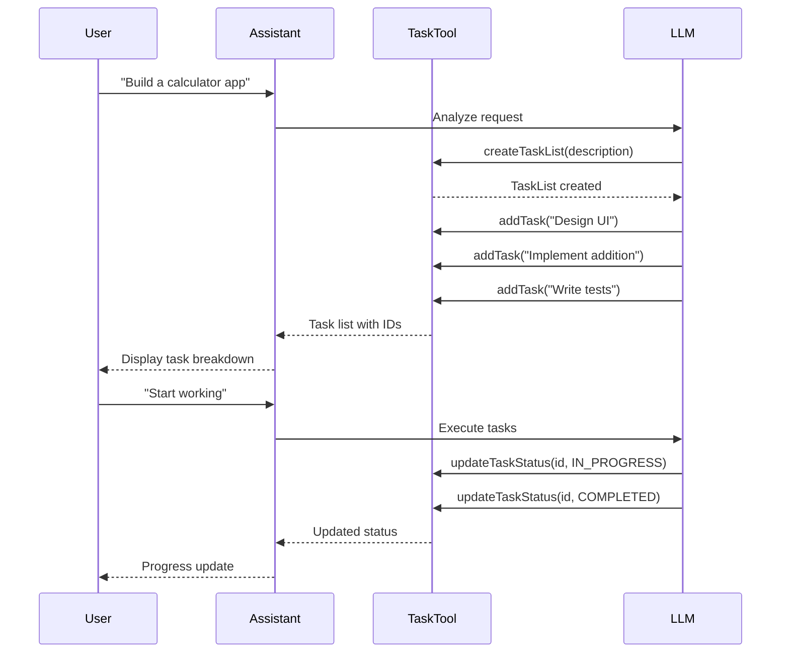

# Task-Tracking Example - Implementation Plan

## Overview

This example demonstrates how to build a task-tracking system using langchain4j that can:
- Break down complex user requests into smaller sub-tasks
- Manage a dynamic task list
- Track task status (PENDING → IN_PROGRESS → COMPLETED)
- Execute tasks iteratively and report progress

## Architecture

### Approach: AI Service with Custom Task Management Tool

We chose the **AI Service + Tool** approach for the following reasons:
- **Balance of simplicity and control**: Simpler than Custom Planner, more flexible than Supervisor
- **Follows existing patterns**: Similar to `simple-tool` example for consistency
- **Clear separation of concerns**: AI handles reasoning, Tool handles state management
- **Extensible**: Easy to add more task management features

### Architecture Diagram



### Task Management Flow



## Component Design

### 1. Domain Models

#### Task.java
```java
public class Task {
    private int id;
    private String description;
    private TaskStatus status;
    private String result;  // Optional: result after completion
    
    // Constructor, getters, setters, toString
}
```

#### TaskStatus.java
```java
public enum TaskStatus {
    PENDING,      // Not started
    IN_PROGRESS,  // Currently being worked on
    COMPLETED     // Finished
}
```

#### TaskList.java
```java
public class TaskList {
    private String description;  // Overall goal
    private List<Task> tasks;
    private int nextId;
    
    // Methods:
    // - addTask(String description): Task
    // - getTask(int id): Task
    // - updateTaskStatus(int id, TaskStatus status): void
    // - completeTask(int id, String result): void
    // - getAllTasks(): List<Task>
    // - getPendingTasks(): List<Task>
    // - getProgress(): String (e.g., "3/5 completed")
}
```

### 2. TaskManagementTool

The tool provides structured methods for the LLM to manage tasks:

```java
@Tool("Create a new task list for a given goal or project")
public String createTaskList(
    @P("Description of the overall goal") String description
)

@Tool("Add a new task to the current task list")
public String addTask(
    @P("Description of the task to add") String taskDescription
)

@Tool("Update the status of a specific task")
public String updateTaskStatus(
    @P("ID of the task to update") int taskId,
    @P("New status: PENDING, IN_PROGRESS, or COMPLETED") String status
)

@Tool("Mark a task as completed with optional result")
public String completeTask(
    @P("ID of the task to complete") int taskId,
    @P("Result or outcome of the task") String result
)

@Tool("Get the current task list with all tasks and their statuses")
public String getTaskList()

@Tool("Get summary of progress")
public String getProgress()
```

### 3. TaskTrackingAssistant (AI Service)

```java
public interface TaskTrackingAssistant {
    
    @UserMessage("""
        Break down the following request into smaller, manageable sub-tasks.
        Create a task list and add each sub-task.
        Return a formatted list showing all tasks with their IDs.
        Request: {{request}}
        """)
    String breakdownTask(@V("request") String request);
    
    @UserMessage("""
        Execute the next pending task in the task list.
        Update its status to IN_PROGRESS, simulate execution, then mark as COMPLETED.
        Return the updated task list showing progress.
        """)
    String executeNextTask();
    
    @UserMessage("""
        Provide a summary of the current progress including:
        - Total tasks
        - Completed tasks
        - In-progress tasks
        - Pending tasks
        Return a formatted progress report.
        """)
    String getProgress();
}
```

## Project Structure

```
task-tracking/
├── pom.xml                                    # Maven configuration
├── README.md                                  # User-facing documentation
├── PLAN.md                                    # This file
└── src/
    ├── main/
    │   └── java/org/example/langchain4j/task/
    │       ├── TaskManagementTool.java        # Tool for task management
    │       ├── TaskTrackingAssistant.java     # AI Service interface
    │       └── domain/
    │           ├── Task.java                  # Task model
    │           ├── TaskStatus.java            # Status enum
    │           └── TaskList.java              # Task list container
    └── test/
        ├── java/org/example/langchain4j/task/
        │   ├── TaskTrackingTest.java          # Main test
        │   └── Models.java                    # Test utilities
        └── resources/
            └── logback-test.xml               # Logging configuration
```

## Implementation Steps

### Phase 1: Project Setup
1. Create `pom.xml` based on `simple-tool` example
2. Set up directory structure
3. Configure dependencies (langchain4j, OpenAI, JUnit, etc.)

### Phase 2: Domain Models
1. Implement `TaskStatus` enum
2. Implement `Task` class with all fields and methods
3. Implement `TaskList` class with task management logic
4. Add proper toString() methods for debugging

### Phase 3: Task Management Tool
1. Create `TaskManagementTool` class
2. Implement singleton pattern (like SimpleDroolsTool)
3. Add all @Tool annotated methods
4. Implement internal state management
5. Add proper error handling and validation

### Phase 4: AI Service Interface
1. Create `TaskTrackingAssistant` interface
2. Add @UserMessage annotations with clear instructions
3. Define method signatures for breakdown, execution, and progress

### Phase 5: Testing
1. Create `Models.java` for test utilities
2. Implement `TaskTrackingTest` with scenarios:
   - Simple task breakdown (e.g., "Create a calculator")
   - Task execution flow
   - Progress tracking
   - Edge cases (empty list, invalid IDs)
3. Add logback-test.xml for test logging

### Phase 6: Documentation
1. Write README.md explaining:
   - What the example demonstrates
   - How to run it
   - Key concepts
   - Code walkthrough
2. Add code comments
3. Include example output

## Test Scenarios

### Scenario 1: Basic Task Breakdown
```
Input: "Build a simple calculator app"

Expected Output:
Task List Created: Build a simple calculator app
- [1] PENDING: Design the user interface
- [2] PENDING: Implement addition function
- [3] PENDING: Implement subtraction function
- [4] PENDING: Implement multiplication function
- [5] PENDING: Implement division function
- [6] PENDING: Write unit tests
- [7] PENDING: Create documentation
```

### Scenario 2: Task Execution
```
Action: executeNextTask()

Expected Output:
Task #1 IN_PROGRESS: Design the user interface
... (simulated work)
Task #1 COMPLETED: Design the user interface
Result: UI mockup created with buttons for operations

Progress: 1/7 tasks completed
```

### Scenario 3: Progress Tracking
```
Action: getProgress()

Expected Output:
Progress Report:
- Total Tasks: 7
- Completed: 3
- In Progress: 1
- Pending: 3

Completed Tasks:
✓ Design the user interface
✓ Implement addition function
✓ Implement subtraction function

In Progress:
→ Implement multiplication function

Pending:
- Implement division function
- Write unit tests
- Create documentation
```

## Key Design Decisions

### Why AI Service + Tool?
- **Simplicity**: Easier to understand and maintain than Custom Planner
- **Flexibility**: Tool provides structured task management without complex planning logic
- **Consistency**: Follows the pattern established in `simple-tool` example
- **Extensibility**: Easy to add new task management features

### Why Not Custom Planner?
- More complex to implement
- Requires deeper understanding of Planner interface
- Overkill for this use case
- Harder to maintain

### Why Not Supervisor Planner?
- Less control over task status updates
- Task management would be implicit rather than explicit
- Harder to track individual task states
- Not as clear for demonstrating task tracking

## Dependencies

Based on `simple-tool/pom.xml`:
- langchain4j-core: 1.9.1
- langchain4j-open-ai: 1.9.1
- JUnit Jupiter: 5.10.0
- AssertJ: 3.24.2
- Logback: 1.5.19

## Future Enhancements

Potential additions for future versions:
1. **Task Dependencies**: Tasks that must complete before others can start
2. **Task Priority**: High/Medium/Low priority levels
3. **Task Assignment**: Assign tasks to different agents
4. **Task Estimation**: Time estimates for each task
5. **Task History**: Track changes and updates over time
6. **Parallel Execution**: Execute multiple independent tasks simultaneously
7. **Task Validation**: Validate task completion criteria
8. **Persistence**: Save/load task lists from storage

## Success Criteria

The implementation will be considered successful when:
1. ✅ User can provide a complex request
2. ✅ System breaks it down into sub-tasks automatically
3. ✅ Tasks are tracked with proper status transitions
4. ✅ Progress can be queried at any time
5. ✅ Test demonstrates full workflow end-to-end
6. ✅ Code follows existing project patterns
7. ✅ Documentation is clear and complete